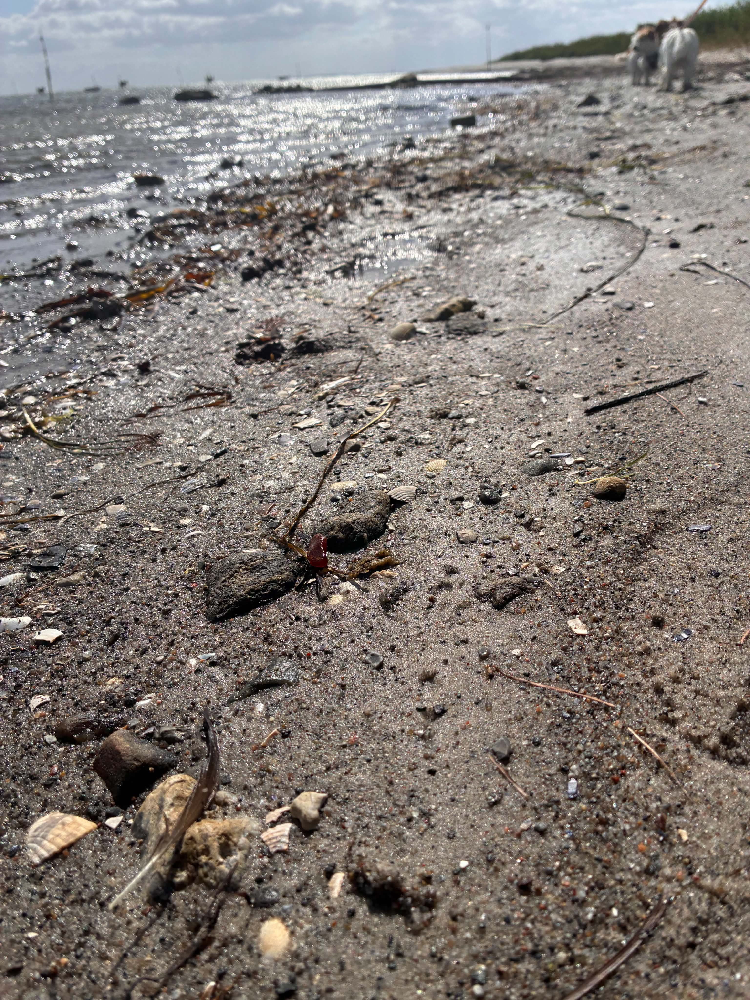
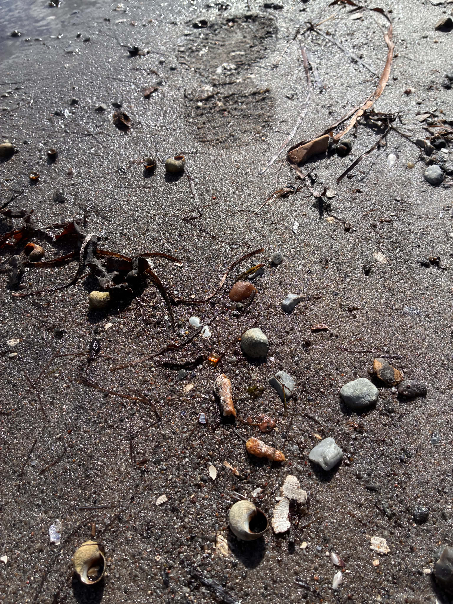
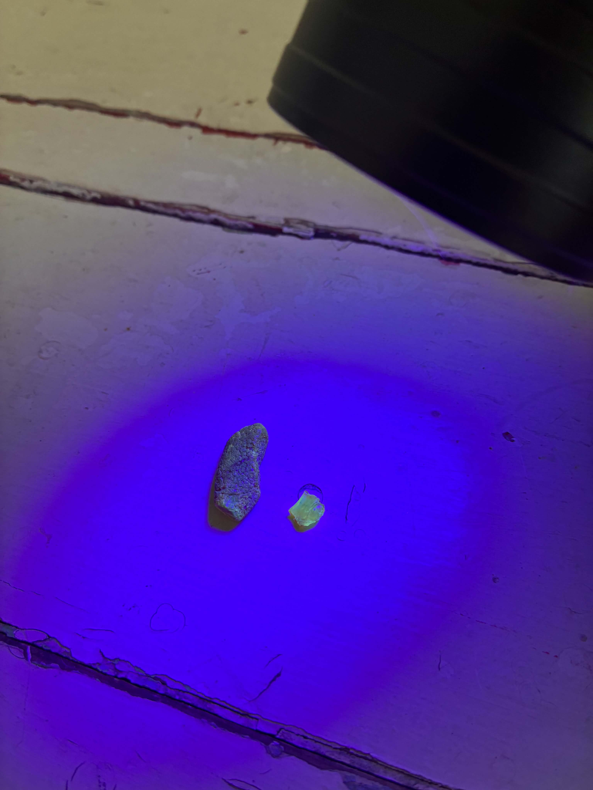

Efter at have tjekket ravprognosen på [ravudsigten](https://ravudsigten.dk), besluttede jeg mig for at tage en tur til kysten ved [Hundested](https://ravudsigten.dk/prognoser/hundested). Det var en smuk sensommerdag, og hundene skulle selvfølgelig med ud at luftes.

Turen startede med et møde med et par turister, der spurgte, hvornår færgen mon gik. På grund af dagens blæst måtte jeg desværre fortælle dem, at færgen ikke ville sejle før tidligst i morgen.

Jeg fandt en god pind og kastede den i vandet, så hundene havde noget at fornøje sig med, mens jeg tog hul på ravjagten med blikket rettet mod vandkanten.

Ikke langt fra færgelejet, hvor færgen sejler til Kulhuse, faldt jeg over det første stykke. Det var et mellemstort stykke, som ikke var særlig gennemsigtigt, men stadig interessant. Jeg skød et hurtigt billede og puttede stykket sikkert i lommen.

Blot få meter efter lå der endnu et lille stykke. Her var jeg slet ikke i tvivl – det var rav! Det røg hurtigt ned til det andet stykke.

Det blev ikke til mere rav i denne omgang, men hundene var blevet godt afkølede, og jeg havde fået masser af frisk luft til hovedet. Nu var det tid til at komme hjem og få tjekket det største stykke om det mon var rav.

Som det kan ses på billedet, lyste ravet op under UV-lyset. Det var måske ikke det mest markante lys, men absolut nok til at bekræfte, at det var ægte rav. En skøn afslutning på en dejlig sensommertur ved kysten!